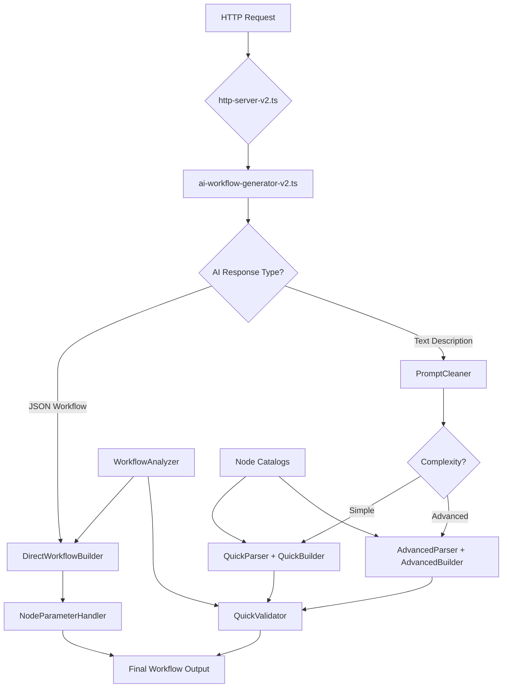

# n8n-MCP Workflow Generation System - File Map & Architecture

## 🗂️ System Architecture Overview



## 📁 Active Files (Currently in Use)

### Core Workflow Generation
| File | Purpose | Status | Dependencies |
|------|---------|--------|--------------|
| `ai-workflow-generator-v2.ts` | Main orchestrator | ✅ ACTIVE | All builders, parsers |
| `direct-workflow-builder.ts` | AI JSON → Workflow | ✅ ACTIVE | node-parameter-handler |
| `quick-parser.ts` | Simple prompt parsing | ✅ ACTIVE | n8n-node-catalog |
| `quick-builder.ts` | Simple workflow building | ✅ ACTIVE | None |
| `advanced-prompt-parser.ts` | Complex prompt parsing | ✅ ACTIVE | None |
| `advanced-workflow-builder.ts` | Complex workflow building | ✅ ACTIVE | node-templates |
| `node-parameter-handler.ts` | Parameter management | ✅ ACTIVE | workflow-builder.types |

### Validation & Analysis
| File | Purpose | Status | Dependencies |
|------|---------|--------|--------------|
| `workflow-analyzer.ts` | Requirement extraction | ✅ ACTIVE | None |
| `quick-validator.ts` | Workflow validation | ✅ ACTIVE | None |
| `prompt-cleaner.ts` | Prompt sanitization | ✅ ACTIVE | None |

### Node Management
| File | Purpose | Status | Dependencies |
|------|---------|--------|--------------|
| `n8n-node-catalog.ts` | Static node definitions | ✅ ACTIVE | None |
| `semantic-node-matcher.ts` | Intelligent matching | ✅ NEW | None |
| `node-capability-registry.ts` | Node capabilities | ✅ NEW | None |

### HTTP Servers
| File | Purpose | Status | Notes |
|------|---------|--------|-------|
| `http-server-v2.ts` | Main HTTP API | ✅ ACTIVE | Primary server |
| `http-server.ts` | Old HTTP API | ⚠️ LEGACY | Should be removed |

## 🔄 File Interactions & Data Flow

### 1. **AI Response Path** (Most Common)
```
1. HTTP Request → http-server-v2.ts
2. → ai-workflow-generator-v2.ts
3. → Provider (OpenAI/Anthropic) → AI Response
4. → DirectWorkflowBuilder
   → NodeParameterHandler (parameter fixes)
   → Post-processing (error handling, connections)
5. → Final Workflow JSON
```

### 2. **Parsed Prompt Path** (Fallback)
```
1. HTTP Request → http-server-v2.ts
2. → ai-workflow-generator-v2.ts
3. → PromptCleaner (clean duplicate workflows)
4. → QuickParser or AdvancedParser (based on complexity)
5. → QuickBuilder or AdvancedBuilder
6. → QuickValidator (fix connections)
7. → Final Workflow JSON
```

## ⚠️ Issues & Redundancies

### 1. **Duplicate/Obsolete Files**
- `enhanced-node-catalog.ts` - Not integrated, duplicates functionality
- `ai-workflow-generator.ts` (v1) - Superseded by v2
- `ai-workflow-generator-v3.ts` - Parallel implementation, unclear usage
- `http-server.ts` - Old server, should use v2

### 2. **Potential Conflicts**
- **Node Catalog Confusion**: 
  - `n8n-node-catalog.ts` (static definitions)
  - `enhanced-node-catalog.ts` (not used)
  - `semantic-node-matcher.ts` (new intelligent matching)
  - Need to integrate these into a single system

- **Multiple Workflow Generators**:
  - v1, v2, v3 all exist
  - Only v2 is actively used
  - v3 has learning features but unclear integration

### 3. **Missing Integrations**
- `semantic-node-matcher.ts` and `node-capability-registry.ts` are created but not fully integrated
- Enhanced catalog exists but isn't used by the main flow

## 🛠️ Recommendations

### 1. **Immediate Actions**
```bash
# Remove obsolete files
- src/ai-workflow-generator.ts (v1)
- src/http-server.ts
- src/workflow-generation/enhanced-node-catalog.ts (if not integrating)
```

### 2. **Integration Tasks**
- Integrate `semantic-node-matcher.ts` into `quick-parser.ts` for better node selection
- Use `node-capability-registry.ts` in `node-parameter-handler.ts` for parameter generation
- Merge enhanced catalog features into main catalog

### 3. **Consolidation**
- Choose between v2 and v3 generators
- Single HTTP server
- Unified node catalog system

## 📊 Current System Stats

- **Total Files**: ~25 active files
- **Redundant Files**: ~5 files
- **New Unintegrated**: 3 files
- **Critical Path Files**: 7 files

## 🎯 Next Steps

1. **Clean Up**: Remove redundant files
2. **Integrate**: Connect new semantic matching to existing flow
3. **Test**: Ensure all paths work correctly
4. **Document**: Update this map as changes are made

## 🔍 Key Questions to Resolve

1. Should we keep v3 generator with learning capabilities?
2. How to integrate semantic matching without breaking existing flow?
3. Should enhanced catalog replace or augment existing catalog?
4. Is there a need for both simple and advanced builders?